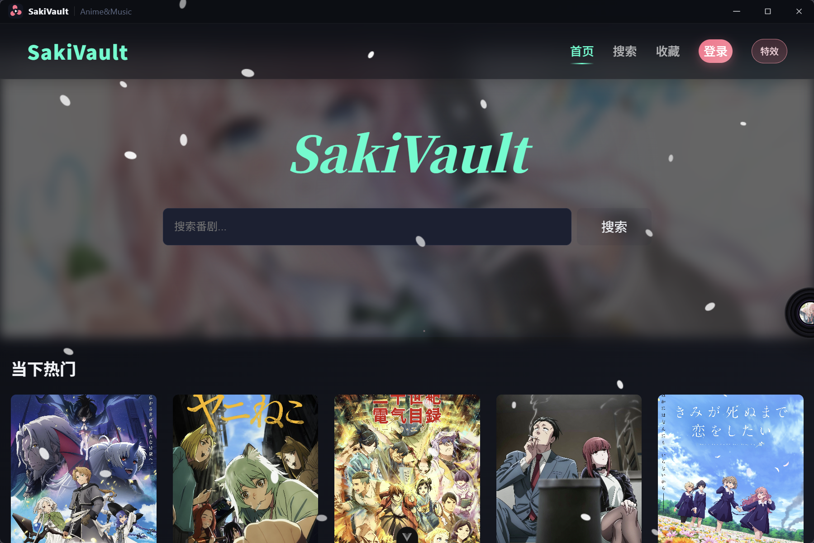
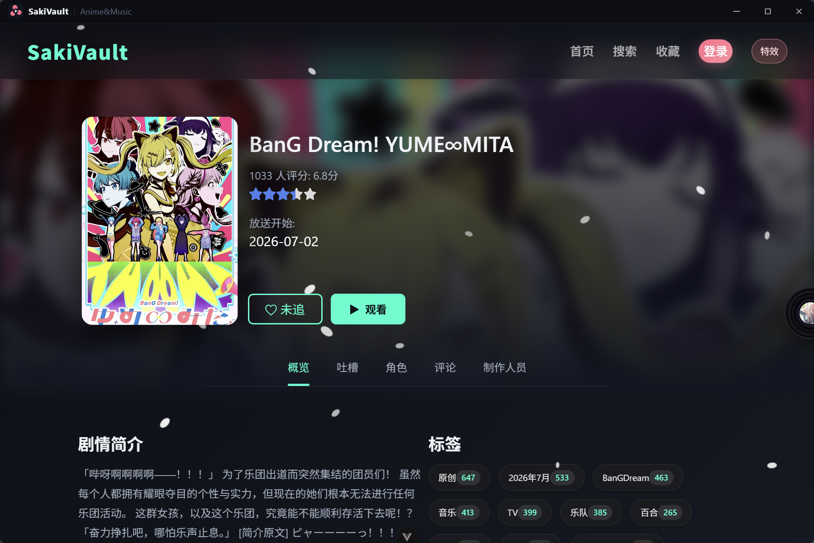
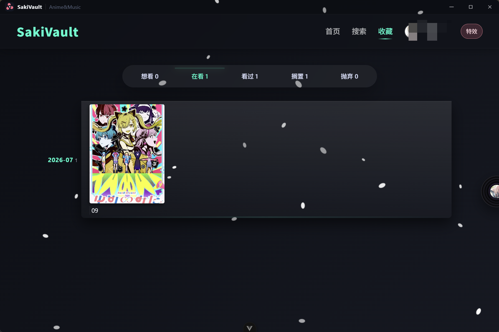
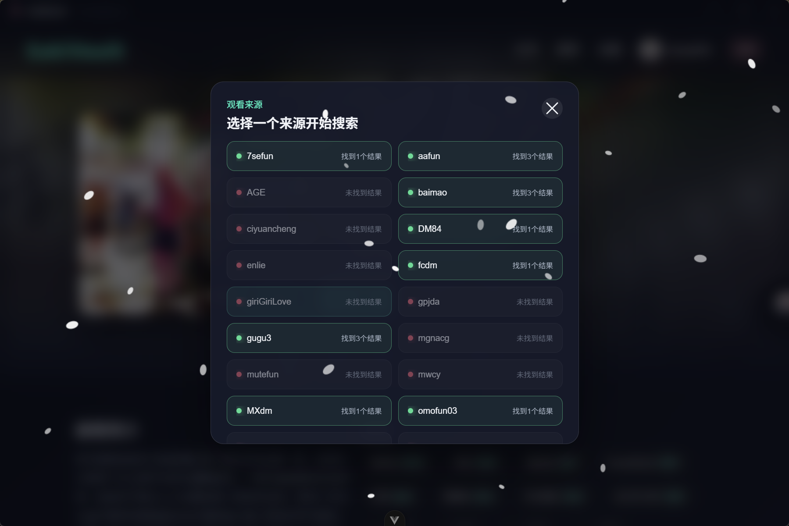
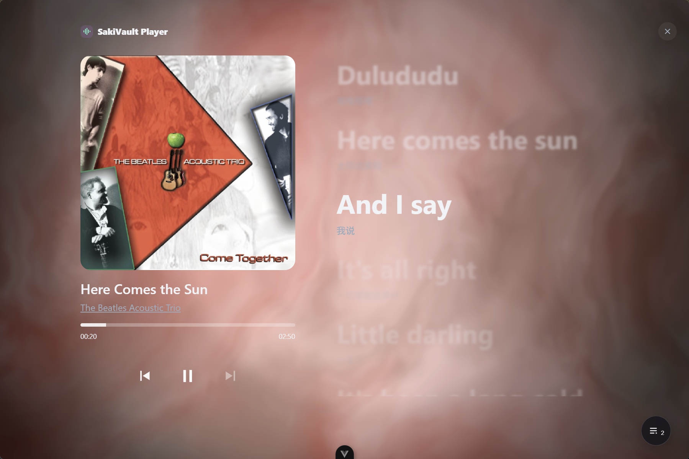

# SakiVault

> 一个面向动漫爱好者的桌面媒体中心：浏览番剧、同步收藏、按规则检索观看源，并在同一应用内管理音乐播放。

SakiVault 不是静态展示页，而是一个基于 **Vue 3 + TypeScript + Electron** 构建并可打包为 Windows 安装程序的桌面应用。项目围绕真实的 Bangumi 数据、用户本地状态、受限的 Electron IPC 通信和桌面端发布流程实现完整体验。


## 项目亮点

- **桌面端交付**：自定义无边框标题栏、窗口控制 IPC、Hash 路由兼容 `file://` 安装包环境，并通过 electron-builder 生成 Windows NSIS 安装程序。
- **完整番剧浏览链路**：接入 Bangumi API，覆盖首页推荐、搜索筛选、详情页、角色/评论/制作人员信息与收藏管理。
- **本地收藏与 Bangumi 同步**：支持“想看、在看、看过、搁置、抛弃”等状态；本地持久化，并按更新时间处理与 Bangumi 的双向同步。
- **可配置观看源**：读取本地 Kazumi 规则库，在 Electron 主进程中以隔离隐藏窗口完成来源检索、剧集解析与播放地址嗅探；搜索结果带缓存，避免重复请求。
- **沉浸式音乐播放器**：封面取色、动态背景、音频频率响应、全屏播放界面与播放列表，并为低性能设备提供特效开关。
- **桌面安全边界**：渲染进程不启用 Node，借助 preload + contextBridge 暴露最小化 API；主进程对可访问的 Bangumi Next 路径及观看源 URL 进行校验。

## 功能一览

| 模块 | 能力 |
| --- | --- |
| 番剧浏览 | 热门推荐、轮播、搜索、筛选、详情子页面 |
| 收藏系统 | 本地收藏、状态管理、Bangumi Token 登录与同步 |
| 动漫观看 | 多规则来源检测、可用性状态、剧集线路解析、视频播放 |
| 音乐播放 | 播放控制、全屏模式、播放列表、音频响应式背景 |
| 桌面体验 | 自定义标题栏、窗口控制、Windows 安装包、性能模式 |








## 技术架构

```text
Vue Renderer
├── Vue Router / Pinia / VueUse
├── Bangumi API、收藏与音乐交互
└── window.electronAPI（preload 最小暴露）
          │ IPC
Electron Main Process
├── 窗口控制与系统代理网络请求
├── Kazumi 本地规则读取与校验
└── 隐藏窗口解析来源、剧集与媒体地址
          │
Bangumi API / 本地 KazumiRules / 外部观看来源
```

## 技术栈

| 分类 | 技术 |
| --- | --- |
| 前端 | Vue 3、TypeScript、Vite、Vue Router、Pinia |
| 桌面端 | Electron、electron-builder、preload / IPC |
| 数据与媒体 | Axios、Bangumi API、hls.js、Kazumi Rules |
| 交互与视觉 | VueUse、Three.js、Web Audio API |
| 工程质量 | Vitest、Playwright、ESLint、Oxlint、Prettier |

## 本地开发

### 环境要求

- Node.js `^22.18.0 || >=24.12.0`
- Windows（桌面端打包目标）

### 安装与启动 Web 开发环境

```bash
npm install
npm run dev
```

默认访问 `http://localhost:5173`。

### 启动 Electron 开发环境

先启动 Vite 开发服务器，再在另一终端执行：

```bash
npm run start
```

### 质量检查

```bash
npm run type-check
npm run test:unit
npm run test:e2e
npm run lint
```

### 构建 Windows 安装包

```bash
npm run dist:win
```

安装包会输出至 `release/`。若构建提示 `EBUSY`，请先关闭正在运行的 SakiVault 进程，避免 `release/win-unpacked` 被占用。

## 项目结构

```text
src/
├── api/             # Bangumi 请求封装
├── components/      # 番剧、观看、音乐、标题栏等可复用组件
├── composables/     # 搜索与收藏等组合式逻辑
├── router/          # Web / Electron 路由配置
├── stores/          # 收藏、登录、同步状态
├── utils/           # 音频响应、封面取色、规则校验与 XPath 解析
└── views/           # 首页、搜索、详情、收藏、观看页

electron/
├── main.ts          # 主进程：窗口、IPC、规则解析与网络请求
├── preload.cjs      # 安全暴露给渲染进程的桌面 API
└── KazumiRules/     # 本地观看规则库（构建时作为额外资源复制）
```

## 使用说明与边界

- 番剧信息来自 Bangumi；登录 Token 仅保存在本地，用于读取和同步用户收藏。
- 观看功能只解析用户本地规则所指向的公开网页，不托管、不提供任何视频内容或资源。
- 桌面端网络请求默认遵循系统代理设置；若所在网络无法访问相关服务，请在代理客户端开启系统代理或使用可用网络。

## 简历项目描述

> 独立开发并交付 SakiVault 桌面番剧媒体中心，使用 Vue 3、TypeScript、Electron 构建 Windows 应用。接入 Bangumi API，实现搜索、详情、收藏及基于时间戳的双向同步；设计 preload/IPC 安全通信边界，在主进程完成本地规则解析、隐藏窗口抓取与视频流地址嗅探；实现音频响应式全屏播放器，并完成 electron-builder 安装包发布。

## 后续方向

- 提供规则库的增量更新与来源健康度统计。
- 补充播放历史、断点续播与本地媒体库。
- 扩展自动化测试覆盖，尤其是 Electron IPC 与打包后启动链路。

## 第三方声明与版权

- 番剧信息由 [Bangumi](https://bgm.tv/) 提供，相关条目数据及图片版权归原权利人所有。
- 动漫观看规则来自 [Predidit/KazumiRules](https://github.com/Predidit/KazumiRules)，遵循其 MIT License；项目仅使用规则进行页面解析，不托管、上传或提供视频内容。
- 音乐功能使用第三方音乐源配置。音乐、歌词、封面及播放链接的相关权利归各自权利人或服务提供方所有；本项目不存储、不分发音频文件。
- SakiVault 仅供个人学习与技术交流使用。使用者应自行遵守所在地法律法规，以及相关内容平台的服务条款。